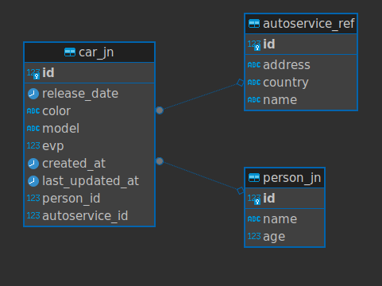

# Описание
Реестр машин, которые могут быть привязаны к   
определённому владельцу и автосервису

swagger: http://localhost:8080/swagger-ui/index.html

# Сборка проекта
Сборка описана для UNIX подобных систем.  
На системах WINDOWS может отличаться сборка JAR файла, поэтому
предпочтительнее использовать WSL в случае WINDOWS 

./mvnw clean package -DskipTests  
docker compose up --build
# Окружение
.properties основной файл окружения  
# Порты
Для приложения 8080  
Для базы данных 5440  
Чтобы поменять порты, нужно изменить их  
в файле .properties и в docker-compose.yml
# Структура БД

